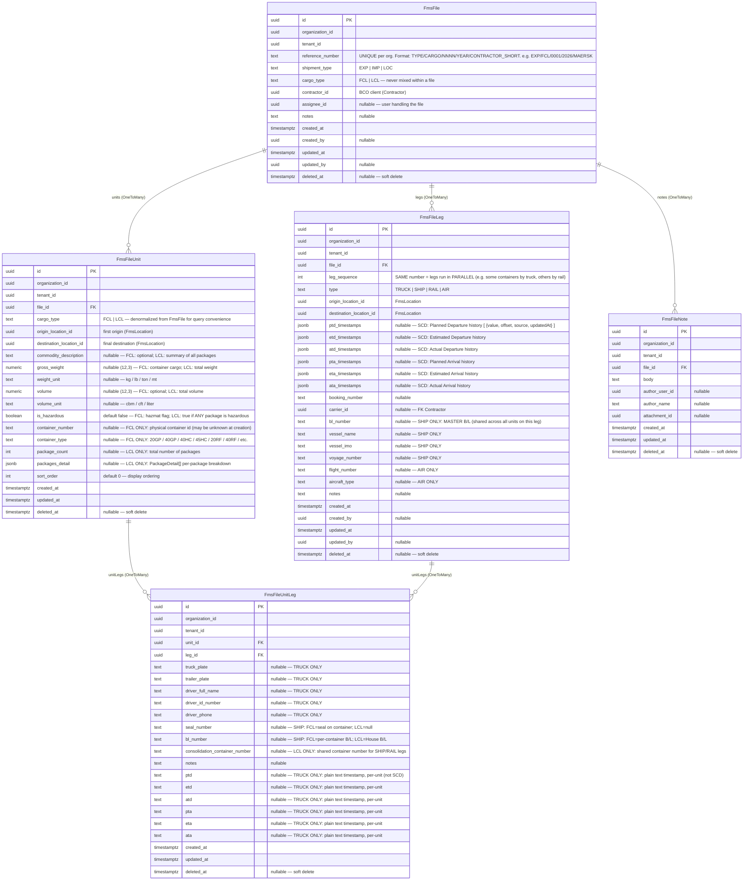

# FMS Files — Entity Diagram



---

## SCD Timestamp Pattern (on `FmsFileLeg`)

Each of the 6 JSONB columns is an **append-only array** of `LegTimestampEntry`:

```ts
type LegTimestampEntry = {
  value: string           // ISO 8601 datetime
  offset: string | null   // e.g. "+08:00" or "Z"
  source: 'carrier_api' | 'manual' | 'ais' | 'port' | 'edi'
  updatedAt: string       // when this entry was recorded
  sourceEventId?: string | null
}
```

- **No "current" column** — resolved at read time: entry with latest `updatedAt` wins.
- **PTD/PTA** are new concepts; legacy `FmsSeaContainer` only had ETD/ETA/ATD/ATA.
- Deduplication: appending the same `value+source` pair is a no-op.

## Timestamp Routing by Leg Type

| Leg type | Where timestamps live | Semantics |
|---|---|---|
| **TRUCK** | `FmsFileUnitLeg.ptd/etd/atd/pta/eta/ata` (plain text) | Per-unit — each truck dispatches independently |
| **SHIP / RAIL / AIR** | `FmsFileLeg.*Timestamps` (SCD JSONB) | Shared — all units on the leg depart/arrive together |

## `cargo_type` Split Logic

| Field | FCL | LCL |
|---|---|---|
| Units per file | One per container | One for the whole file |
| `container_number` / `container_type` | Populated | `null` |
| `package_count` / `packages_detail` | `null` | Populated |
| `consolidation_container_number` (UnitLeg) | `null` | Shared container for SHIP/RAIL |
| `bl_number` (UnitLeg) | Per-container B/L | House B/L |

## B/L Number Placement

| Level | Field | Scope |
|---|---|---|
| `FmsFileLeg.bl_number` | Master B/L | Shared across all units on the SHIP leg |
| `FmsFileUnitLeg.bl_number` | Per-unit B/L | FCL: container B/L · LCL: House B/L |
| `FmsFileUnitLeg.consolidation_container_number` | Shared container | LCL only, for SHIP/RAIL |

## Derived File Status (no `status` column)

| Status | Condition |
|---|---|
| **Empty** | No units or no legs |
| **Planning** | Has units but leg chain is incomplete |
| **Ready** | All units have a complete origin→destination leg chain |
| **In Transit** | At least one leg has ATD but no ATA |
| **Delivered** | All final legs have ATA |
| **Partially Delivered** | Some final legs have ATA, others don't |
