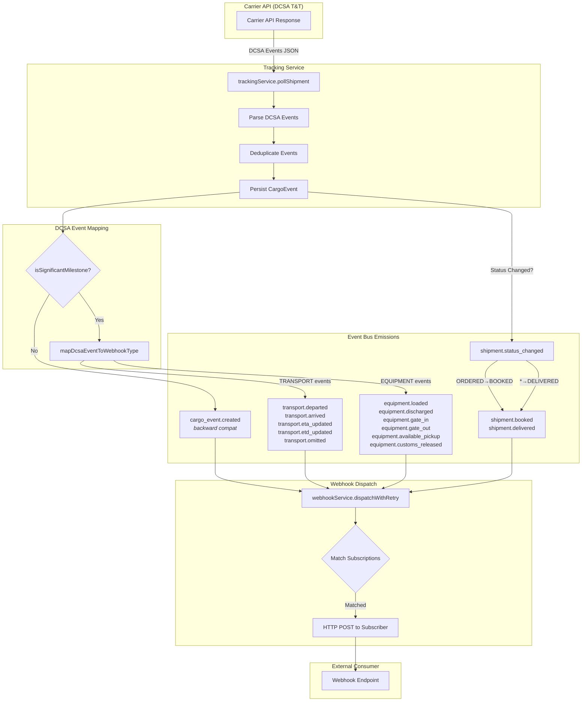
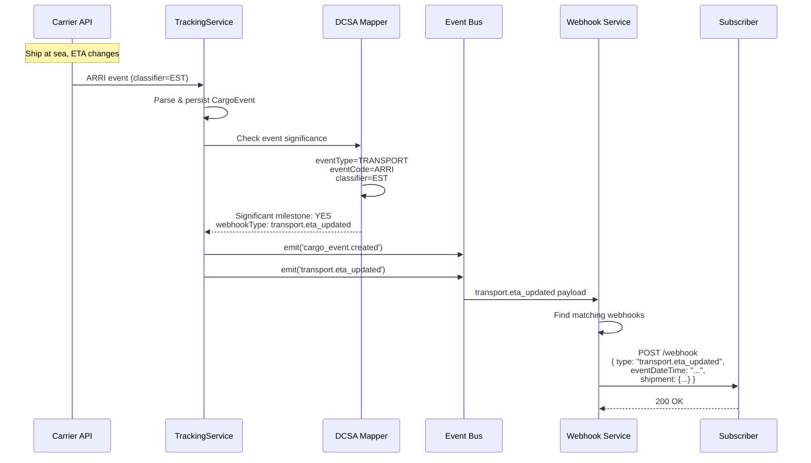
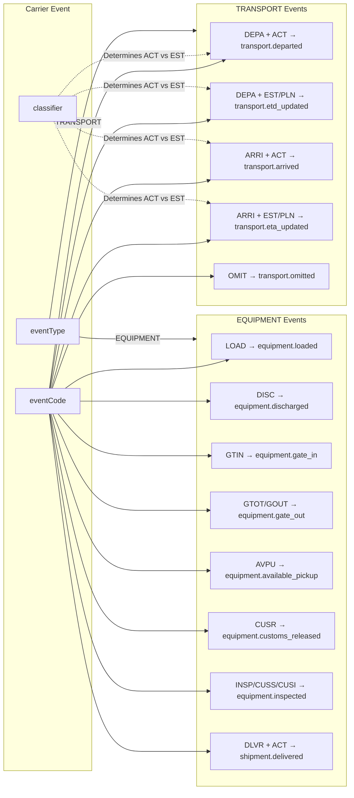
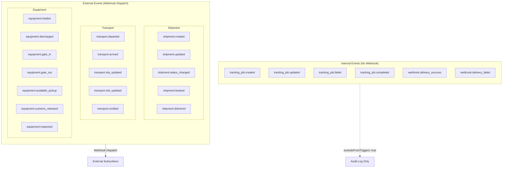

# DCSA Event Flow

This document describes the flow of DCSA-compliant tracking events from carrier APIs to webhook consumers.

## Event Processing Flow

## ETA Update Flow (Ship at Sea)

## DCSA Event Code Mapping

## Internal vs External Events

